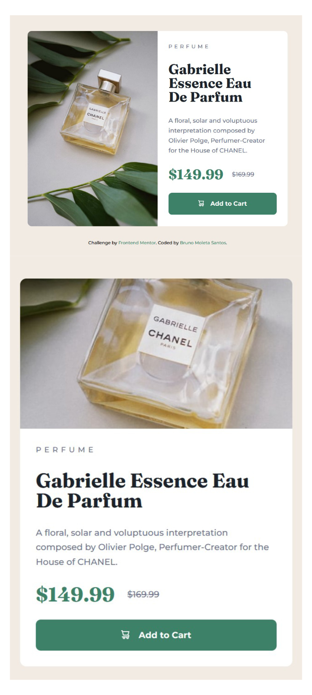

# Frontend Mentor - Perfume card solution

That is a solution to the [Perfume card challenge on Frontend Mentor](https://www.frontendmentor.io/challenges/product-preview-card-component-GO7UmttRfa). Frontend Mentor challenges help you improve your coding skills by building real projects. 

## Table of contents

- [Overview](#overview)
  - [The challenge](#the-challenge)
  - [Screenshot](#screenshot)
  - [Links](#links)
- [My process](#my-process)
  - [Built with](#built-with)
  - [What I learned](#what-i-learned)
  - [Continued development](#continued-development)
  - [Useful resources](#useful-resources)
- [Author](#author)

**Note: Delete this note and update the table of contents based on what sections you keep.**

## Overview

### The challenge

Users should be able to:

- View the optimal layout depending on their device's screen size;
- See hover and focus states for interactive elements;

### Screenshot




### Links

- [Code on GitHub](https://github.com/brunomoleta/crispy-enigma)
- [Live Site](https://brunomoleta.github.io/crispy-enigma/)

## My process

### Built with

- Semantic HTML5 markup
- CSS custom properties
- Flexbox
- CSS Grid


### What I learned

It was the first time I separated each component into a different file, making the code more maintainable.
A valuable part of the code, I believe, is to put a ```button``` element as big as the ```padding-inline``` allows it to be:

```css
.perfume__btn {
  width: 100%;
}

.perfume__info {
  grid-area: "info";
  padding-inline: var(--card-text-padding-inline);
}
```
Another highlight is on the **button.css**, where the ```svg``` is css pseudoelement:

```
.perfume__btn:before {
  display: inline-flex;
  content: "";
  background-image: URL(../images/icon-cart.svg);
  background-repeat: no-repeat;
  height: var(--cart-dimensions);
  width: var(--cart-dimensions);
  margin-right: var(--button-cart-margin);
  align-items: center;
}
```
The margin-right sets the distance between the *cart image* and the *text* inside the ```button```.

### Continued development

Learn how to *remove* or *add* a ```class``` (probably possible with ```js```) depending on the user's screen width.

### Useful resources

- [Jad Joubran HTML/CSS](https://learnhtmlcss.online/) - Great resource for a fair price tag.
- [:before](https://www.geeksforgeeks.org/how-to-use-svg-with-before-or-after-pseudo-element/) - How I got the ```:before``` pseudoelement done right.


## Author

- LinkedIn - [Bruno Moleta Santos](https://www.linkedin.com/in/bruno-moleta-santos/)
- Frontend Mentor - [@brunomoleta](https://www.frontendmentor.io/profile/brunomoleta)

<!--  -->