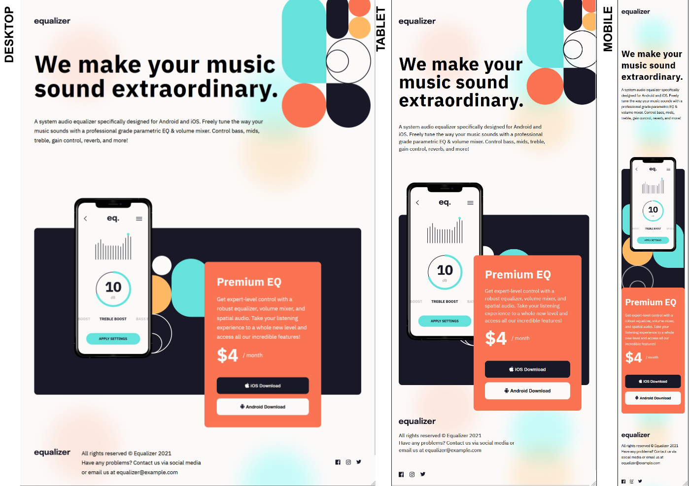

# Frontend Mentor - Equalizer landing page solution

This is a solution to the [Equalizer landing page challenge on Frontend Mentor](https://www.frontendmentor.io/challenges/equalizer-landing-page-7VJ4gp3DE). Frontend Mentor challenges help you improve your coding skills by building real life projects.

## Table of contents

- [Overview](#overview)
  - [The challenge](#the-challenge)
  - [Screenshot](#screenshot)
  - [Links](#links)
- [My process](#my-process)
  - [Built with](#built-with)
  - [What I learned](#what-i-learned)
  - [Continued development](#continued-development)
  - [Useful resources](#useful-resources)
- [Author](#author)

**Note: Delete this note and update the table of contents based on what sections you keep.**

## Overview

### The challenge

Users should be able to:

- View the optimal layout on desktop, tablet and mobile screensizes;

### Screenshot



### Links

- Solution URL: [Github repo](https://github.com/brunomoleta/congenial-telegram)
- Live Site URL: [Live Link](https://brunomoleta.github.io/congenial-telegram/)

## My process

### Built with

- Flexbox
- CSS Grid
- Mobile-first workflow

### What I learned

It was a challenge to use both grid and flexbox in the top right vector illustration. To do so, I wrote:

```html
<div class=" big-illustration grid__illustration grid">
  <div class="big-illustration__rectangle-blue grid__blue"></div>
  <!-- black, red, yellos -->
  <div class="flex grid__triple">
    <div class="big-illustration__rectangle-black"></div>
    <div class="flex column">
      <div class="big-illustration__small-circle-red"></div>
      <div class="big-illustration__small-circle-yellow"></div>
    </div>
  </div>
  <!-- end  -->
  <!-- lines -->
  <div class="big-illustration__circle-line flex align-itens-center">
    <div class="big-illustration__small-circle-line"></div>
  </div>
  <!-- end of lines -->
  <div class="big-illustration__circle-red"></div>
  <div class="big-illustration__circle-black"></div>
</div>
```

```c
.grid__illustration {
  width: 100%;
  height: var(--header-ill-four-tablet);

  grid-template-areas:
    "bleu  ...."
    "bleu  ...."
    "....  ....";
}
```

### Continued development

For the next deep layout challenge I will evaluate better the gaps between the main elements on the page that are common on all layout sizes so that the code 
turn out leaner.

### Useful resources

- [Jad Joubran Learn HTML/CSS](https://learnhtmlcss.online/) - Jad Joubran's content is always a valuable resource. I went over it to remember how to use ::before on css.

## Author

- Frontend Mentor - [@brunomoleta](https://www.frontendmentor.io/profile/brunomoleta)
