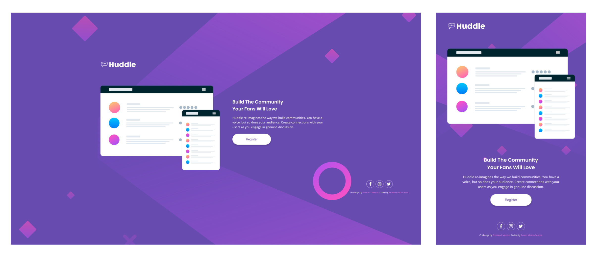

# Frontend Mentor - Huddle landing page with a single introductory section solution

It is a solution to the [Huddle landing page with a single introductory section challenge on Frontend Mentor]
(https://www.frontendmentor.io/challenges/huddle-landing-page-with-a-single-introductory-section-B_2Wvxgi0).
Frontend Mentor challenges help you improve your coding skills by building real projects.

## Table of contents

- [Overview](#overview)
  - [The challenge](#the-challenge)
  - [Screenshot](#screenshot)
  - [Links](#links)
- [My process](#my-process)
  - [Built with](#built-with)
  - [What I learned](#what-i-learned)
  - [Continued development](#continued-development)
  - [Useful resources](#useful-resources)
- [Author](#author)
- [Acknowledgments](#acknowledgments)

**Note: Delete this note and update the table of contents based on what sections you keep.**

## Overview

### The challenge

Users should be able to:

- View the optimal layout for the page depending on their device's screen size
- See hover states for interactive elements on the page

### Screenshot



### Links

- Solution URL: (https://github.com/brunomoleta/cuddly-memory)
- Live Site URL: (https://brunomoleta.github.io/cuddly-memory/)

## My process

### Built with

- Semantic HTML5 markup
- CSS custom properties
- Flexbox

### What I learned

\_About the semantic structure in HTML, it was made as follows:

```HTML
  <body>
    <div><!-- background-image --></div>
    <main>
      <section>
        <div>
          <figure><!-- is figure semantically necessary? I don't know for sure -->
            <!-- Huddle Logo. I thought about putting it in a <header>,
              but prefered this way to gather it with the mockups illustrations on flex.
            Besides, it's not a <header> per se -->
          </figure>
          <figure>
            
              <!-- mockups-illustration -->
          </figure>
        </div>
        <div>
          <div>
            <h1></h1>
            <p>
          </div>
          <button>
          </button>
        </div>
      </section>
    </main>
    <footer>
      <ul aria-label="Social media links"><!-- aria-lavel to make the <ul> a landmark semantically  -->
        <li>
          <a>
            <svg></svg>
          </a>
        </li>
        <li>
          <a>
            <svg></svg>
          </a>
        </li>
        <li>
          <a>
            <svg></svg>
          </a>
        </li>
      </ul>
    </footer>
  </body>

```

\_To send #everything forward in the z-axis, I used opacity to fix the position of a small background image: "background-size: cover" separated from the background color, set in the body.

```css
body {
  background-color: hsl(257, 40%, 49%);
}

#bg-image {
  position: absolute;
  background-image: URL("./images/bg-desktop.svg");
  background-size: cover;
  background-position: 620px;
  width: 100vw;
  height: 100vh;
  z-index: -1;
}
```

\_Making the social media icons change the color with :hover along with the border took a while. I did the following:

```css
.a-social-media: hover,
.a-social-media:hover > svg {
  fill: hsl(300, 69%, 71%);
  border: 1px solid hsl(300, 69%, 71%);
}
.a-social-media:hover > svg {
  border: none;
}
```

The first part is to change the interior side of the
social media icon (the fill) and the border(the circle).
But without the second part (border: none),:hover
would also create a square "border" around the icon, that's
why.

A doubt I had was: should it be: a group with the logo (Huddle) alongside
the illustration' or 'independent logo wrapped with
a <header>', making it separate from the content?
I chose the first option to keep it aligned with the main illustration:

```HTML
<main>
  <section>
    <div id="illustrations">
      <figure>
        
        <figcaption>Huddle Logo</figcaption>
      </figure>
      <figure>
        
        <figcaption>mockups illustration</figcaption>
      </figure>
    </div>
  </section>
</main>
```

So to fix the logo to the illustration.

About the workflow, I started with the desktop version.
Doing the social media icons first, then the main layout.
After that, I went back and forth with the mobile version
and how it would scale to smaller screen size versions.

### Continued development

Something to be aware of in the future challenges is that, as
I develop the layout in a 24inch screen and the responsiveness in
a device that is neither smaller than the @media specification
nor in my screen size may get whacked.
This intermediate size is
a place I have not yet grasped how to manage.

### Useful resources

- [Jad Joubran's Learn HTML Course](https://learnhtmlcss.online/) - Beginner-friendly course, no videos and thoroughly explained. Terrific resource.

## Author

- Website - [Bruno Moleta Santos](https://github.com/brunomoleta)
- Frontend Mentor - [@brunomoleta](https://www.frontendmentor.io/profile/brunomoleta)
